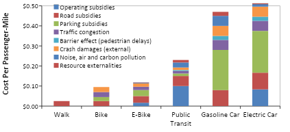

```{r}
sections <- params$sections
d <- params$tract_data
crashes <- params$crash_data

```

# Attack on traditional transportation in `{r} print(params$county)`

Americans used to value lively neighborhoods, green grass, and areas where kids and their families could get around with just their legs or a bike. With the advent of things like cars, social media, and changing values, the way we interact with eachother is fundamentally different. Traditional means of transportation are under attack by car lobbyists.

**What's at stake?**

### Cost of living

The number one concern of constituents is the cost of living. For many families who are hurting, especially those in rural areas, the car is the largest household expense, including some often-overlooked costs such as parking, loan interest, and local taxes to help maintain essential infrastructure like roads. Families need choices to managing costs without changing how they live and work.

```{r map, fig.width=6, fig.height=4}
library(ggplot2)
library(sf)
library(dplyr)

d <- params$tract_data
county_name <- params$county

d <- d |>
  mutate(is_selected = COUNTY_NAME == county_name)

ggplot(d) +
  geom_sf(aes(fill = transitCost), 
          color = "grey",
          linewidth=0.05)+
  geom_sf(
    data = d |> filter(is_selected),
    fill = NA,
    color = "#16A595",
    linewidth = 0.8)+
  labs(title = "Annual transportation costs for the average car owning family by census tract",
        subtitle = county_name)+ 
  scale_fill_distiller(palette = "RdYlGn", n=4)+
  theme_void()
```

#### High taxes

The funds needed to construct and maintain roads are not keeping up with the population’s demands. Taxes and registration fees only cover about 58% of road costs, the rest is paid for by the government. Georgia can address road funding shortfalls in short sited ways like raising taxes or investing in more fiscally responsible means or transportation.

[](https://nyc.streetsblog.org/2025/06/23/car-harms-monday-why-driving-is-bad-for-business-household-wealth-and-community-prosperity-in-8-images)

This figure compares external costs, including public infrastructure subsidies, of six modes. Driving has higher costs per passenger-mile and since motorists travel far more than non-drivers their annual external costs are high. Source: [**Litman 2025**](https://www.vtpi.org/tca)

#### Traffic safety

Traffic deaths are preventable and they’re happening on the roads the state owns and maintains. The state DOT already knows where the most dangerous intersections are and many of them lack basic pedestrian infrastructure. Unmarked crossings and missing sidewalks force people into traffic and create dangerous situations.

```{r map, fig.width=6, fig.height=4}
library(ggplot2)
library(sf)
library(dplyr)

c <- params$tract_data
county_name <- params$county

c <- c |>
  mutate(is_selected = COUNTY_NAME == county_name)

ggplot(c) +
  geom_sf(aes(fill = transitCost), 
          color = "grey",
          linewidth=0.05)+
  geom_sf(
    data = d |> filter(is_selected),
    fill = NA,
    color = "#16A595",
    linewidth = 0.8)+
  labs(title = "Annual transportation costs for the average car owning family by census tract",
        subtitle = county_name)+ 
  scale_fill_distiller(palette = "RdYlGn", n=4)+
  theme_void()

```

## Intercity rail is an affordable alternative

Intercity trains aren’t about changing how Americans live. They’re about lowering costs, protecting infrastructure, and keeping small towns connected. Intercity trains are a cost-saving option that lets rural households keep more of their own money. They give families another option when driving isn’t convenient, like on long trips, in bad weather or areas with limited parking. Trains protect roads the same way bypasses protect small towns, by keeping through-traffic off local infrastructure.

## State DOT can maintain their sidewalks and shoulders

[pie chart ] - Seniors and aging in place As rural populations age, safe sidewalks and shoulders keep people away from vehicles an allow seniors to stay independent without driving. - Kids and schools In many towns, children cross state highways to get to school or the bus stop. Predictable places for pedestrians make roads much safer. - Veterans and people with disabilities For people with disabilities, sidewalks are basic ADA infrastructure, not luxury upgrades.

## Trails connect people and businesses

Georgia is already home to many successful trails that serve walkers, runners, and cyclists, and provide opportunities for transportation, exercise, nature and recreation for both residents and tourists. In addition to making it easier to walk and bike for those who want to do so, trails connect people with shopping centers and encourages visitors to participate, stay longer, and ultimately increase the amount they spend on items like food and beverages. - Economic ben
